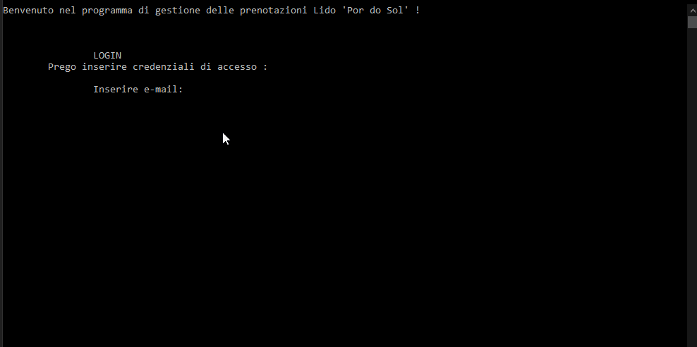

# UNIBA_LABINF_StabilimentoBalneare

The system simulates an automated management platform of a bathhouse. Specifically, the program will have to deal with what concerns the management of access to the system (access is in relation to the data acquired from files), the modification of data relating to accessing users, the management of daily reservations relating to umbrellas and the consequent management of the availability of these. The system will also take care of the modification and removal of the reservations made and the printing as output of the reservations for each date.

Il sistema simula una piattaforma di gestione automatizzata di uno stabilimento balneare. Nello specifico, il programma dovrà occuparsi di  ciò che concerne la gestione degli accessi al sistema (l’accesso è in relazione ai dati acquisiti da file), la modifica dei dati relativi agli utenti accedenti, la gestione delle prenotazioni giornaliere relative agli  ombrelloni e la conseguente gestione sulle disponibilità di questi. Il sistema si occuperà inoltre della modifica nonché rimozione delle prenotazioni effettuatesi e sulla stampa come output delle prenotazioni per ogni data.

